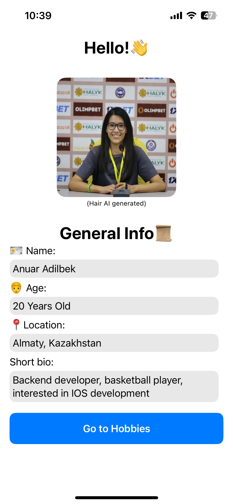
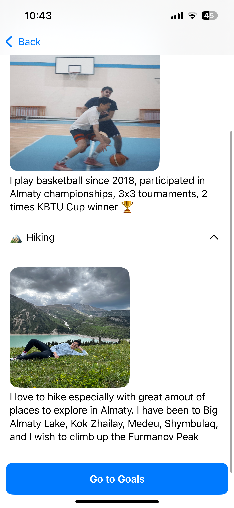
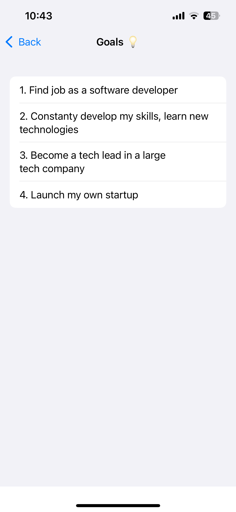

# AboutMe App

## First Screen
On the first screen I used basic VStack, HStack as containers to properly store Text fields. NavigationLink is used to move to the next screen

## Second Screen
On the Hobbies Screen I have added button and gave them animations so that when you click them info is expanded about certain hobby. IsToggled is used to store state of the button.

## Third Screen
On the Goals Screen I stored goals as list of strings and showed them on the view as a List and used ForEach to iterate over these variables.

