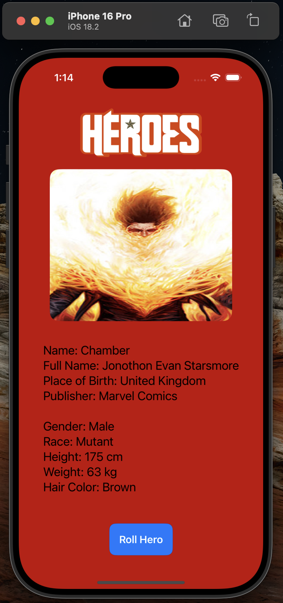
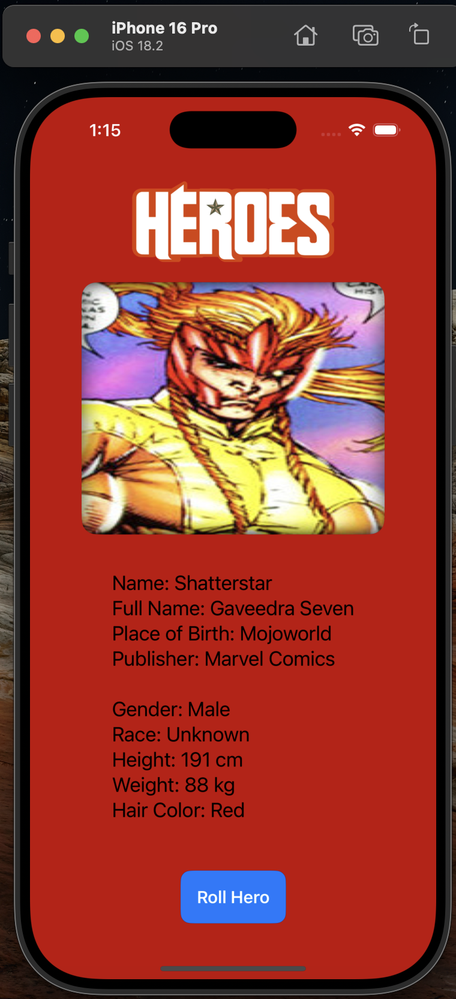

# Assignment 3: SuperHeroRandomizer

First of all I created SuperHeroViewModel.swift file to implement models for data that will be fetched from the link, and implemented fetchHero() method that receives data from link, decodes JSON to our struct and returns information about randomly selected hero.

Next I created ContentView.swift, a SwiftUI view to visualize data received from ViewModel. I created @ObservableObject to subscribe to selectedHero and edit view every time new hero is generated.

Here are screenshots:

